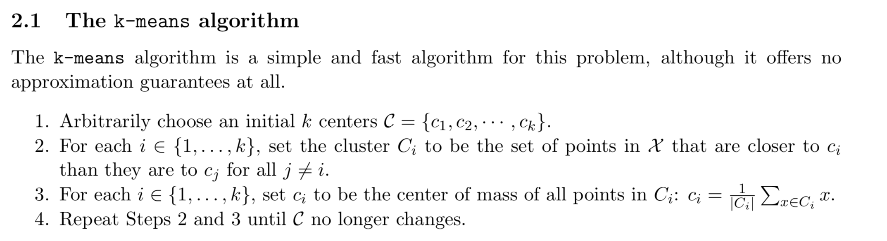
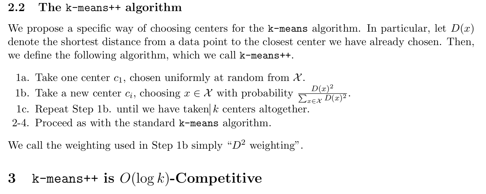
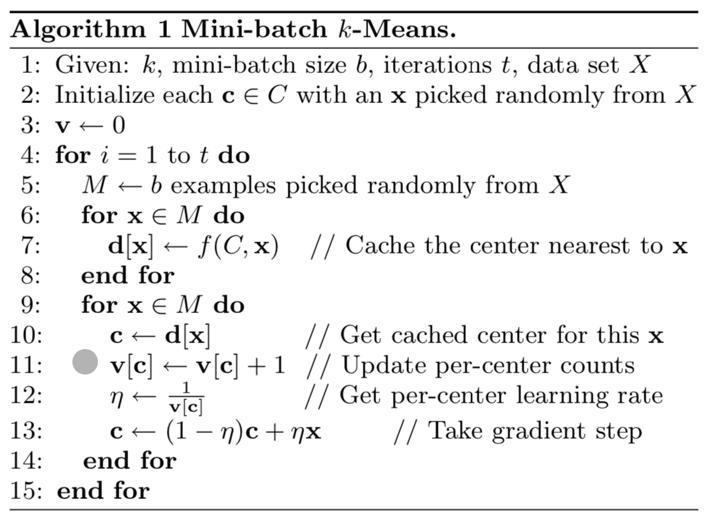

Clustering is an important task in machine learning and data mining.

Here, I will list the traditional and modern clustering methods. If you want to cluster something. This blog may help you.

For each clustering methods, there are three things to kind in mind:
- What is the clustering objective? Show the objective function?
- What is the input?
- What is the output?

# K-Means

- Description from scikit-learn document: The k-means algorithm divides a set of *N* samples *X* in to *K* disjoint clusters *C*, each described by the mean   of the samples in the cluster. The means are commonly called the ccluster "centriods"; note that they are not, in genereal, points from *X*, although they live in the same space.

- **The clustering objective**: 
minimize the **inertia** or **within-cluster sum-of-squares**: 

- Inputs: samples *X*, the number of clusters *k*
- Outputs: cluster of each sample

## Standard k-means

## k-means++

## Mini-Batch K-Means

References:
- [Scikit-learn document-Clustering-K-Means](https://scikit-learn.org/stable/modules/clustering.html#k-means)
- Arthur, David, and Sergei Vassilvitskii. ["k-means++ the advantages of careful seeding."](https://dl.acm.org/doi/pdf/10.5555/1283383.1283494) Proceedings of the eighteenth annual ACM-SIAM symposium on Discrete algorithms. 2007.
- Sculley, David. ["Web-scale k-means clustering."](https://dl.acm.org/doi/pdf/10.1145/1772690.1772862) Proceedings of the 19th international conference on World wide web. 2010.

# Mean-shift

# Spectral clustering

# Ward hierarchical clustering

# Agglomerative clustering

# DBSCAN

# OPTICS

# Gaussian mixtures

# Brich
